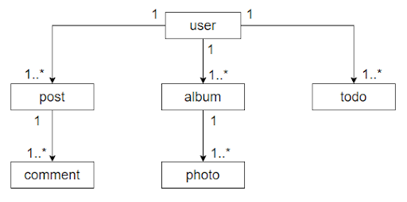

# Nodejs Code Challenge

## Problema
Se necesita hacer una aplicación en la que pueda ver los usuarios y las tareas relacionadas a cada uno

## Backend
Para el challenge se necesita crear dos aplicaciones con las siguientes responsabilidades:
* **App 1**: 
    - Recibir peticiones por http filtrando las mismas por la API_KEY que se encuentra en el archivo `.env_example`
    - Solicitar datos procesados por la **App 2**
* **App 2**: 
    - Recibir mensajes de la **App 1**
    - Obtener los datos desde una **api externa** (`https://jsonplaceholder.typicode.com`). Los mismos deben ser procesados de la siguiente forma:
        ```
        {
            data: [
                ...
            ],
            total: 40
        }
        ```

        **NOTA**: El total es la cantidad máxima de datos

Las rutas posibles para obtener datos de la **api externa** llevan la siguiente estructura:
- GET        /users -- https://jsonplaceholder.typicode.com/users
- GET        /users/1 -- https://jsonplaceholder.typicode.com/users/1
- GET        /users/1/todos -- https://jsonplaceholder.typicode.com/users/1/todos  

Como referencia, el modelo de la **api externa** es el siguiente:



Endpoints de la App 1:
* `/health`: para saber el estado del servidor
* `/users?page=1&pageSize=10`: solicita los datos de los usuarios ya procesados 
* `/users/1`: solicita los datos del usuario 
* `/users/1/todos?page=1&pageSize=10`: solicita los datos de las tareas ya procesadas 

Para la comunicación de las aplicaciones puede usar cualquier tecnología/protocolo de comunicación (*gRPC, REST, etc*)

**Opcional**: La comunicación entre aplicaciones debe ser segura (*credenciales, keys, etc..*)

## Frontend

Hacer un cliente que consuma los datos de la **App 1**. El cliente debe mostrar un listado con paginación tanto para los usuarios como para las tareas. 

No hay ninguna limitación en la elección del framework para el desarrollo de la solución.

### Cómo presentar la solución
Cuando consideres que el problema está resuelto, debes subirlo a un repositorio de tu elección y enviarnos un mail a fsare@culturait.com.ar con el link de descarga, además podes agregar cualquier comentario que creas correspondiente.

**Happy Hacking!**